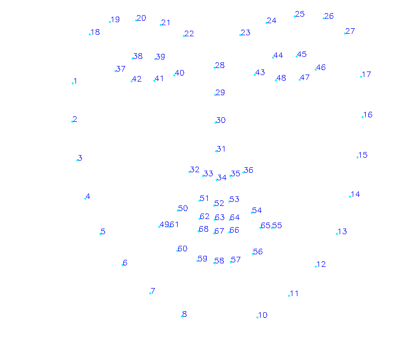
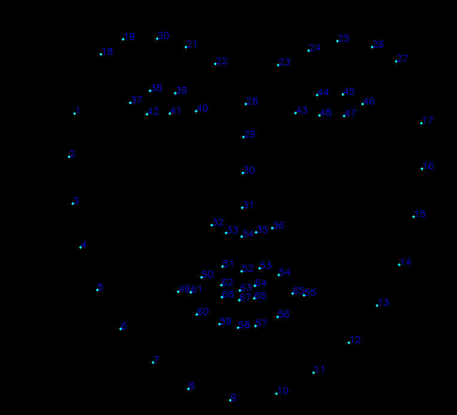

## 原则
> 小步快跑，稳定可靠

### stage 1
* 用 dlib 寻找方框，注意，要包含中心人脸
  * 获取所有文件
  * 根据 pts ，转化为 txt
  * dlib 寻找包含人脸的方框
* 自己下载的 ibug数据，工程提供的3M模型进行 test
* ibug 数据整理为 txt 自定义格式
* 生成 hdf5格式

说明：
1. 自定义格式为 imgpath，l, t, r, b, ...(68 point)
2. 进行 fine tuning 尤其关注 slover及 loss layer，loss
3. 对图片进行增强

TODO:
1. 确定 ibug，dlib，model 68 点顺序一致性

    

    

    

* 进行图片增强
    ```
    结果：
    ```
* 确定 mean，std, 数据预处理（参考 vanlin cnn 训练）

  结果：
  * vanlin cnn 减去了所有均值，lm缩放到[-0.5, 0.5]

  * [网友经验](http://blog.csdn.net/fuwenyan/article/details/53899230)

    > 以卷积神经网络进行图像识别为例，常用的输入图像预处理

    > Step1：Resize

    > Step2：去均值。此处应注意，是对所有训练样本图像求均值，然后将每个样本图片减去该均值。测试图片在进行预处理时，也减去该均值（注意不是减测试图片的均值，而是减去所有训练样本图像的均值）

    > 归一化处理：图像处理应用中一般不需要归一化处理，因为RGB通道数据范围一直是0~255，天生是归一化的，因此不需要再进行归一化处理。

    > PCA降维处理：数据量较大时可以通过PCA进行降维处理，以便减小计算量，提升处理速度。但图像处理应用中，因为一般先进行了图像的Resize处理，降低数据量，因此一般不需要再进行PCA降维处理了。


* 确定网络每次输入，输出矩阵
    ```
    结果：
    ```

### stage 2
> 数据增强，进行test 和 fine tuning

1. 所有图片转换为包含面部的最大正方形且缩放到600*600(落地)
  * 按照 img_dm_lm_flielist(包含图片路径，dm，lm) 加载图片
  * 根据 dm 获取最大 正方形,根据正方形变换dm，lm坐标
  * 缩放到 227 * 227（图片，dm，lm变换）
  * 存储 227_227 到原来图片，及 227imgdmlmfilelist.txt
2. 水平翻转，噪声扰动（椒盐噪声和高斯噪声），包围盒扰动


### stage 3
* 自己下载的 ibug数据,工程提供的prototxt 模型进行 train from scratch


### stage 4
* 自己下载的ibug数据,squeezenet 进行 train from scratch


### stage 5
* 扩大数据，通过dlib进行landmark，对上一阶段的进行 fine tuning


### stage 6
* 优化 dlib 检测速度，参考 [github](https://github.com/hrastnik/face_detect_n_track) / [csnd](http://blog.csdn.net/leo_812/article/details/51945743)
